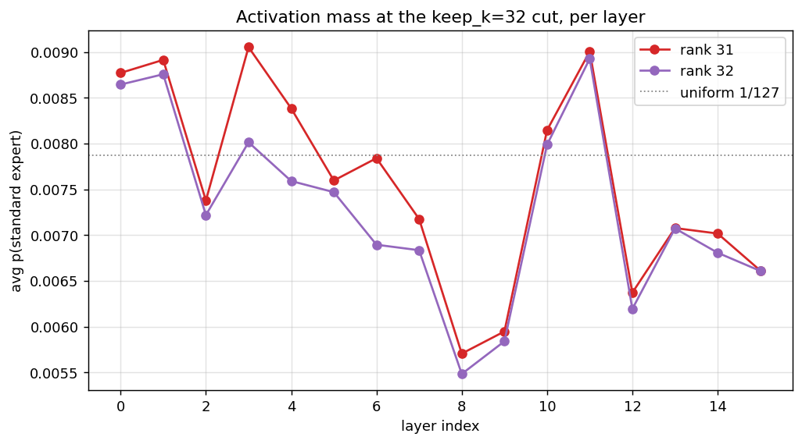
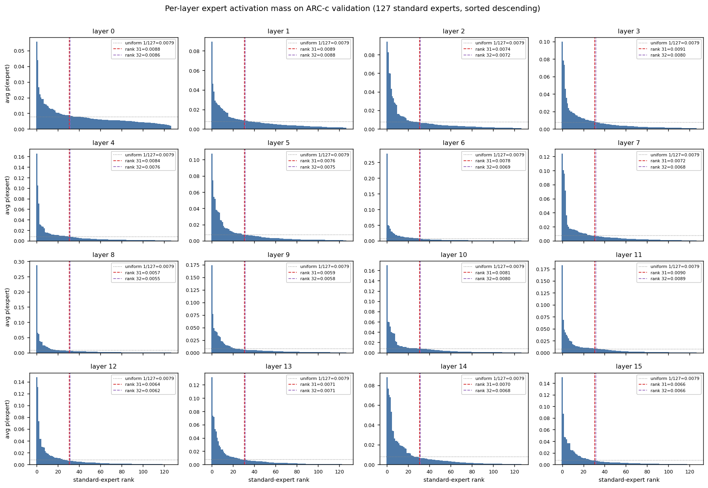

# Per-layer expert activation analysis on ARC-Challenge

Run date: 2026-05-17. Companion to the
[pool-size sweep result](arc_pool_sweep_2026-05-17.md), which showed that
**every** non-uniform per-layer keep-k schedule loses ground to the uniform
baseline under calibration-based greedy pruning. This page asks: what does
the calibration distribution actually look like, per layer, that the pruner
is operating on?

## Method

- Model: `allenai/Emo_1b14b_1T` (L=16, num_experts=128, num_shared=1,
  top_k=8).
- Calibration: the full ARC-Challenge validation split (299 prompts,
  56 101 attention-masked tokens).
- Instrumentation: forward hook on every `layer.mlp` capturing the
  block's `router_logits` output. For each layer, the standard-expert
  softmax (over 127 routed experts) is mass-weighted by the attention
  mask and averaged across all tokens in the calibration set. The result
  is `avg_prob[layer, expert]` — the average probability mass that the
  router assigns to each expert. This is exactly the quantity
  `greedy_prune_layerwise_variable` uses to rank experts when deciding
  which to keep.
- The shared expert is *not* shown in the plots (it has its own size-1
  softmax, so its "probability" is trivially 1.0 and would dominate the
  display). All ranks below are over the **127 standard experts only**.
- The reference horizontal line in the grid is the uniform distribution
  `1/127 ≈ 0.0079`. If the router used every expert equally, every bar
  would sit on that line.

## Headline finding

At `keep_k = 32` (the baseline schedule in the sweep), the pruner keeps
31 standard experts plus the always-active shared expert. **The 32nd
standard expert — the first one the pruner drops — sits essentially on
the uniform line in every layer.**



Across the 16 layers, rank 32's activation mass ranges from 0.0055 (layer
8) to 0.0089 (layer 11), straddling the uniform reference of 0.0079.
The pruner is making its cut on a near-flat plateau.

## Per-layer distributions

Each panel is one layer, x-axis is standard-expert rank (1 = highest
activation), y-axis is average probability mass. The grey dotted line is
the uniform 1/127 reference. The vertical dashed lines mark rank 31 (last
kept) and rank 32 (first dropped) at the baseline `keep_k=32`.



## Per-layer summary

| layer | top1   | rank8  | rank16 | rank31 | rank32 | rank64 | rank127 | top31 mass | top32 mass |
|------:|-------:|-------:|-------:|-------:|-------:|-------:|--------:|-----------:|-----------:|
|    0  | 0.0558 | 0.0162 | 0.0128 | 0.0088 | 0.0086 | 0.0059 | 0.0020  |    0.4842  |    0.4928  |
|    1  | 0.0894 | 0.0242 | 0.0166 | 0.0089 | 0.0088 | 0.0045 | 0.0012  |    0.6160  |    0.6247  |
|    2  | 0.0940 | 0.0283 | 0.0138 | 0.0074 | 0.0072 | 0.0034 | 0.0008  |    0.7138  |    0.7210  |
|    3  | 0.1000 | 0.0211 | 0.0142 | 0.0091 | 0.0080 | 0.0035 | 0.0009  |    0.7130  |    0.7210  |
|    4  | 0.1659 | 0.0236 | 0.0116 | 0.0084 | 0.0076 | 0.0030 | 0.0007  |    0.7451  |    0.7527  |
|    5  | 0.1077 | 0.0347 | 0.0148 | 0.0076 | 0.0075 | 0.0031 | 0.0006  |    0.7400  |    0.7474  |
|    6  | 0.2786 | 0.0229 | 0.0131 | 0.0078 | 0.0069 | 0.0021 | 0.0005  |    0.7943  |    0.8012  |
|    7  | 0.1244 | 0.0175 | 0.0132 | 0.0072 | 0.0068 | 0.0027 | 0.0005  |    0.7569  |    0.7637  |
|    8  | 0.2872 | 0.0234 | 0.0112 | 0.0057 | 0.0055 | 0.0021 | 0.0003  |    0.8109  |    0.8164  |
|    9  | 0.1738 | 0.0321 | 0.0145 | 0.0059 | 0.0058 | 0.0026 | 0.0004  |    0.7802  |    0.7860  |
|   10  | 0.1700 | 0.0373 | 0.0113 | 0.0081 | 0.0080 | 0.0027 | 0.0004  |    0.7530  |    0.7610  |
|   11  | 0.1826 | 0.0247 | 0.0129 | 0.0090 | 0.0089 | 0.0024 | 0.0003  |    0.7604  |    0.7694  |
|   12  | 0.1480 | 0.0289 | 0.0138 | 0.0064 | 0.0062 | 0.0021 | 0.0002  |    0.8097  |    0.8159  |
|   13  | 0.1317 | 0.0288 | 0.0137 | 0.0071 | 0.0071 | 0.0026 | 0.0002  |    0.7820  |    0.7891  |
|   14  | 0.0883 | 0.0262 | 0.0184 | 0.0070 | 0.0068 | 0.0028 | 0.0003  |    0.7776  |    0.7844  |
|   15  | 0.1504 | 0.0367 | 0.0150 | 0.0066 | 0.0066 | 0.0023 | 0.0002  |    0.8032  |    0.8098  |

Uniform-over-127 reference = **0.0079**.

## Three observations

1. **The cut is on a near-uniform plateau.** Rank 32 sits within ±0.0017
   of uniform on every layer. The pruner is choosing among nearly-equally
   used experts at the cutoff, so which specific 31 standard experts
   survive is close to arbitrary at the boundary.

2. **Top-31 keeps 48–81 % of the mass.** That sounds high, but it means
   **19–52 % of the probability mass lives in the 96 dropped experts** —
   each individually below uniform, but collectively significant. That
   dropped mass is exactly what gets re-allocated to the surviving
   experts at inference time, and that re-allocation is what hurts
   accuracy.

3. **Layer 0–1 have shallow heads; layers 6, 8, 12 have narrow ones.**
   Layer 0's top-31 only retains 48 % of the mass; layer 8's retains
   81 %. The pruner's "32 experts is plenty" assumption is much more
   accurate in middle and late layers than in the first two.

## Tension with the sweep result

The activation analysis would predict that the **optimal non-uniform
schedule should keep more experts in the early (shallow-head) layers and
fewer in the late (narrow-head) layers** — i.e. `down_step`:
`[56]*8 + [8]*8`. Late layers concentrate mass on a few experts; dropping
the tail there should be cheap, while pruning a shallow distribution
deletes more mass per expert removed.

The [sweep](arc_pool_sweep_2026-05-17.md) shows the exact opposite:

| schedule                  | spread | acc\_uncond | Δ vs uniform |
|---------------------------|-------:|------------:|-------------:|
| uniform                   |    —   |  0.5452     | (baseline)   |
| `up_step` (narrow early)  |   24   |  0.4716     |  −7.4        |
| `down_step` (narrow late) |   24   |  0.4080     | −13.7        |

`down_step` is **6.4 points worse than `up_step`** at the extreme spread,
even though the distribution analysis says it should preserve more
calibration mass.

Three possible explanations:

- **Average probability ≠ expert importance.** A late-layer tail expert
  with average mass 0.0003 might fire critically on the small subset of
  tokens that need it. The average smooths over rare-but-important
  routing decisions; greedy pruning by average activation discards
  those experts cheaply.
- **Late layers are more specialised per-token.** The mass concentration
  on top-31 reflects which experts handle the *modal* token type, not
  the diversity of routing needed across the input distribution.
- **Greedy ranking by avg activation isn't optimal.** This is well-
  documented in the MoE pruning literature; better criteria
  (gradient-weighted, calibration loss directly) can change the ranking
  near the cutoff significantly.

Distinguishing among these would need: (a) a token-level importance
measure (gradient, perplexity drop), (b) a cross-task probe (does an
ARC-c-calibrated prune transfer worse to MMLU when layers are imbalanced
than when they're uniform?), or (c) random-keep ablations to estimate
the noise floor for "any reasonable subset of 31 standard experts" at
each layer.

## Artifacts

Raw data, plots, and the per-layer JSON live at:

```
/workspace/eval_runs_pool/activation_analysis/arc_challenge/
  avg_probs.npy                  ← (L=16, num_experts=128); last col is shared
  sorted_descending_standard.npy ← (L=16, 127), each row sorted descending
  rank_at_keep_k.json            ← per-layer rank-k values and cumulative masses
  activations_grid.png           ← 16-panel sorted distribution
  rank_marginal_freq.png         ← rank-31/rank-32 across layers
  meta.json                      ← model / task / token counts
```

Source script: `scripts/selective_hf/dump_expert_activations.py`.
Run with `--no-collect` to re-plot without re-running the model.
